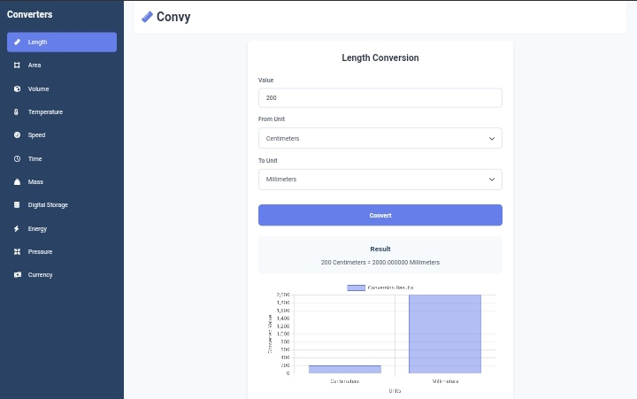

# Convy - Online Converter Calculator

## About

**Convy** is a React-based application for handling some unit conversions. It supports some categories like Length, Area, Volume, Temperature, Speed, Time, Mass, Digital Storage, Energy, Pressure, and Currency. Users can input values, select units and obtain results easily. This also provides a simple chart visualization for each conversion.

---

## Features

- **Unit Conversion**: Converts between multiple units across different categories.
- **Categories Supported**:
  - Length
  - Area
  - Volume
  - Temperature
  - Speed
  - Time
  - Mass
  - Digital Storage
  - Energy
  - Pressure
  - Currency
- **Interactive Chart**: Displays a chart visualizing the conversion results.
- **Responsive Design**: Adjusts sidebar visibility based on screen size.
- **Real-Time Currency Rates**: Fetches the latest exchange rates from an API.

---

## Usage

1. Select a conversion category (e.g., Length, Area, Currency) from the sidebar.
2. Input the value to be converted.
3. Choose the **From Unit** and **To Unit** using the dropdowns.
4. View the result along with a visual representation in the chart.

---

## Conversion Logic

- For non-currency units:
  - Converts to a base unit.
  - Converts from the base unit to the target unit.
- For temperature:
  - Applies specific conversion formulas (e.g., Celsius to Fahrenheit).
- For currency:
  - Fetches exchange rates and calculates conversions.

---

### Key States:
- `activeConverter`: Tracks the selected conversion category.
- `inputValue`, `fromUnit`, `toUnit`: Manages user input and unit selections.
- `result`: Displays the conversion result.
- `currencies`, `exchangeRates`: Stores currency data fetched from the API.

---

## Future Enhancements

- **Dark Mode**: Add support for dark mode for better usability in low-light conditions.
- **Unit Suggestions**: Automatically suggest popular unit conversions based on user input.
- **Save History**: Allow users to save and revisit past conversions.
- **Localization**: Support for multiple languages.

---

## License

This project is licensed under the MIT License. See the [LICENSE](LICENSE) file for details. 

---

## Acknowledgments

- **React**: For the dynamic and efficient UI components.
- **Open Exchange Rates API**: For providing real-time currency data.
- **Chart.js**: For chart visualizations.
